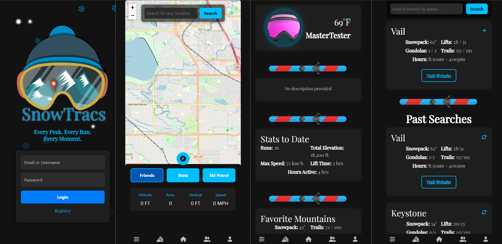

# SnowTracs 📍🏂  
### **The Ultimate GPS Tracking App for Snowboarding and Skiing**

**SnowTracs** is a full-stack MERN (MongoDB, Express, React, Node.js) application that brings real-time GPS tracking, performance analytics, and social features to snow sports enthusiasts. Whether you're snowboarding or skiing, this app helps you track your every run, every peak, and every moment.

---

## **Features**

### 🗺️ **Live GPS Tracking**
- Real-time location tracking with **Leaflet** + **OpenStreetMap**.
- Custom emoji markers (⛷️ for skiers, 🏂 for snowboarders).
- Search for any location on the map and fly to it.

### 🎿 **Resort Information**
- Search for ski resorts by name.
- Display resort data including:
  - **Snowpack** (inches)
  - **Lifts** open/total
  - **Gondolas** open/total
  - **Trails** open/total
  - **Operating Hours**
- Past searches saved locally for quick access.

### 📊 **Performance Analytics**
- Measure and display:
  - **Altitude**
  - **Runs Completed**
  - **Vertical Feet**
  - **Speed (MPH)**
- Session stats saved and viewed in **Stats** section.

### 🆘 **SOS Feature**
- One-tap access to SOS functionality (planned for future).

### 🌦️ **Weather Integration**
- Display current temperature.
- Toggle between **Celsius** and **Fahrenheit** in settings.

### 🏆 **Social Features**
- Add and manage friends.
- View friends' stats and session info.
- Share achievements (Planned).

### 💾 **Offline Mode**
- Cache data for use without internet.

---

## **Tech Stack**

| Layer        | Technology                           |
|--------------|--------------------------------------|
| **Frontend** | React + TypeScript                   |
| **Mapping**  | Leaflet, OpenStreetMap               |
| **Backend**  | Node.js, Express, GraphQL            |
| **Database** | MongoDB, Mongoose ODM                |
| **Styling**  | Custom CSS Modules                   |
| **Auth**     | JWT Authentication                   |
| **Icons**    | Font Awesome                         |
| **Deployment** | Render + GitHub Actions             |

---

## **Screenshots**


---

## **Pages Overview**

- **Login Page**: Authenticate with email/password. JWT token storage.
- **Home Page**: Map view, live GPS tracking, action buttons for **Friends**, **Stats**, and **Ski Patrol**.
- **User Profile**: Customize avatar, view top stats, favorite mountains, and session history.
- **Settings**: Toggle dark mode, offline mode, unit preferences, and logout.
- **Resorts**: Search and view resort data dynamically from backend.
- **Friends**: Manage friends list, view their stats and status.
- **Stats**: Access detailed session analytics, download/share stats, and view history.

---

## **Installation**

### 1. Clone the repository:
```bash
git clone https://github.com/yourusername/snowtracs.git
cd snowtracs
```

### 2. Install dependencies:
```bash
npm install
cd client && npm install
cd ../server && npm install
```

### 3. Environment Variables:
Create a `.env` file in the **server** directory:
```env
MONGODB_URI=your_mongodb_connection_string
JWT_SECRET=your_jwt_secret
```

### 4. Running Locally:
```bash
npm run dev
```

### 5. Deployment:
- Render deployment:  
  [Click Me!](https://snowtracs.onrender.com)

  GitHub deployment:  
  [Click Me!](https://github.com/joshsdesk/SnowTracs)

---

## **Planned Enhancements**

- 🎮 **Achievements & Gamification**: Earn badges and track milestones.
- 🗺️ **Augmented Reality Trails**: Overlay trail directions on the map.
- ⌚ **Smartwatch Integration**: Sync stats with wearables.
- 🚨 **Advanced SOS Alerts**: Auto-alerts with GPS coordinates.
- 🌐 **Localization**: Multi-language support.

---

## **Contributing**

We welcome contributions from the community! 🚀

1. Fork the repository.
2. Create a new feature branch.
3. Commit and push your changes.
4. Submit a pull request for review.

---

## **License**

MIT License.  
Feel free to use, modify, and distribute.

---

## **Author**

- **Josh Bourassa** – Lead Developer

---

## **Resources**

- [Leaflet Documentation](https://leafletjs.com/)
- [Font Awesome Icons](https://fontawesome.com/icons)
- [GraphQL](https://graphql.org/)
- [MongoDB Atlas](https://www.mongodb.com/cloud/atlas)

---

**Every Peak. Every Run. Every Moment.**
